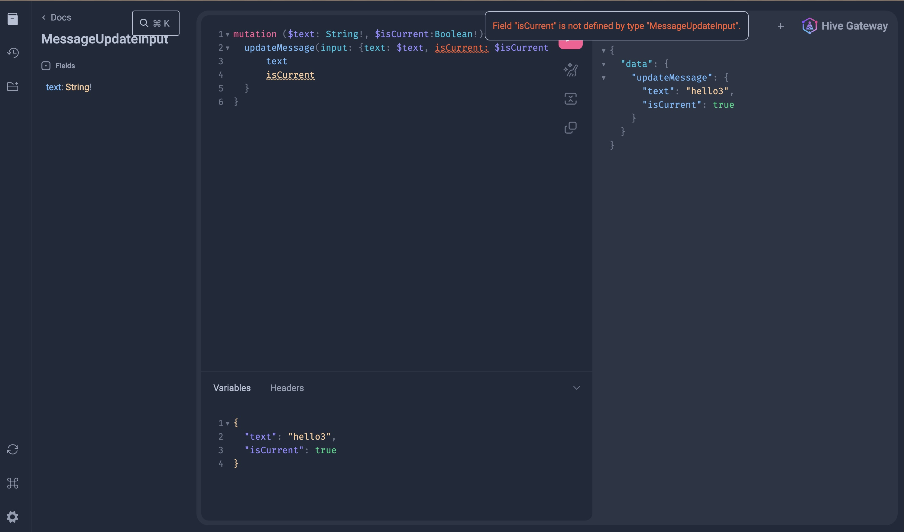

## Instructions to recreate the bug

* `nvm use 22`
* `npm i --force` << mock uses an old version of `express-graphql`
* `npm run compose`
* `npm run start-api`
* `npm start`
* Go to http://localhost:4000/graphql?query=mutation+($text:+String!,+$isCurrent:Boolean!)%7B%0A++updateMessage(input:+%7Btext:+$text,+isCurrent:+$isCurrent%7D)+%7B%0A++++++text%0A++++++isCurrent%0A++%7D%0A%7D


## Outcomes

### Expected
```
mutation ($text: String!, $isCurrent:Boolean!){
  updateMessage(input: {text: $text, isCurrent: $isCurrent}) {
      text
      isCurrent
  }
}
```
is a valid mutation

### Actual
An error `Field isCurrent is not defined by type "MessageUpdateInput"`




## The problem
`isCurrent` is a deprecated input field. It exists in the `supergraph.graphql` however it is not in the IntrospectionQuery
```
type Mutation @join__type(graph: GRAPH)  {
  updateMessage(input: MessageUpdateInput!) : Message!
}

input MessageUpdateInput @join__type(graph: GRAPH)  {
  text: String!
  isCurrent: Boolean @deprecated(reason: "Don't use anymore") 
}
```

This causes issues with generating client schemas using the IntrospectionQuery

This only happens if:
* The deprecated field is an input field. Deprecated fields in query objects appear and are in the IntrospectionQuery.
